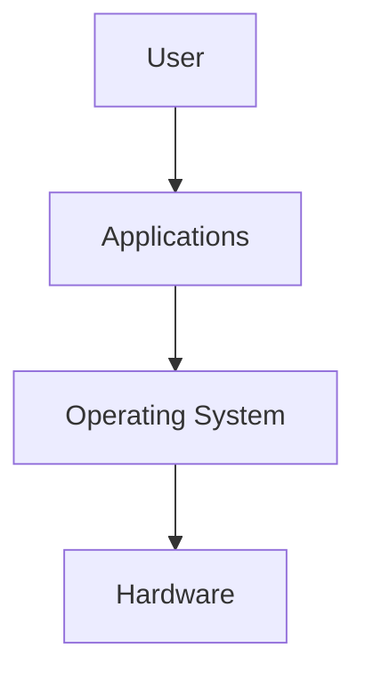
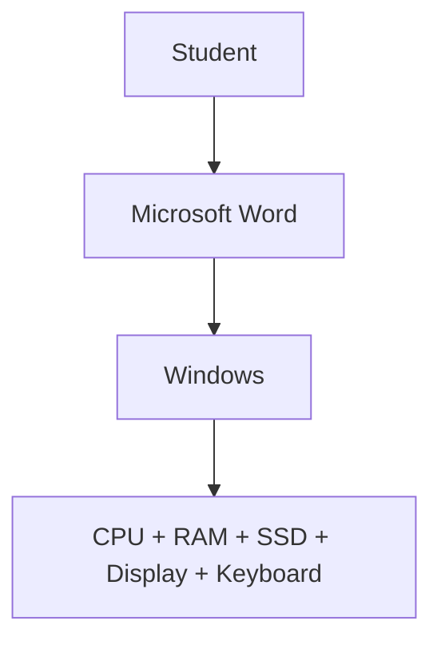
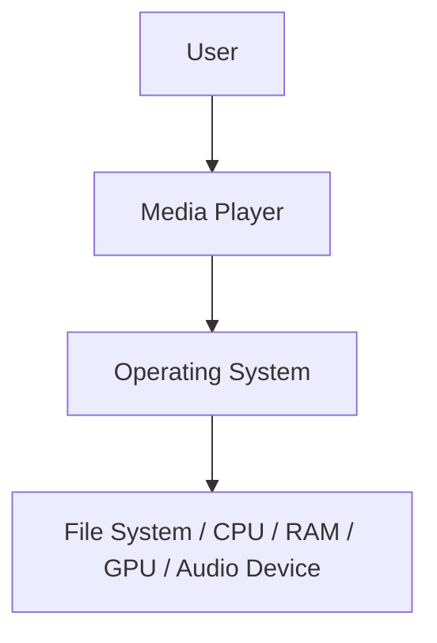

# 🖥️ Operating Systems Lab — Lab 01

## Operating Systems Overview, Windows Tools & Essential Shortcut Keys

---

## 📋 Table of Contents

1. [Lecture Information](#1-lecture-information)
2. [Learning Objectives](#2-learning-objectives)
3. [Introduction](#3-introduction)
4. [What is an Operating System?](#4-what-is-an-operating-system)
5. [Why Do We Need an Operating System?](#5-why-do-we-need-an-operating-system)
6. [OS as an Intermediary](#6-operating-system-as-an-intermediary)
7. [Introduction to Microsoft Windows](#7-introduction-to-microsoft-windows)
8. [Windows Environment Components](#8-important-components-of-the-windows-environment)
9. [File Explorer](#9-file-explorer)
10. [Essential Keyboard Shortcuts](#10-essential-windows-keyboard-shortcuts)
11. [Win + R — Run Dialog](#11-win--r--run-dialog)
12. [Run Commands](#12-practical-windows-run-commands)
13. [msinfo32 — System Information](#13-msinfo32--system-information)
14. [taskmgr — Task Manager](#14-taskmgr--task-manager)
15. [Task Manager — Performance Tab](#15-task-manager--performance-tab)
16. [Win + I — Settings](#16-win--i--windows-settings)
17. [Win + L — Lock Workstation](#17-win--l--lock-workstation)
18. [Alt + Tab — App Switching](#18-alt--tab--application-switching)
19. [Win + D — Desktop](#19-win--d--desktop)
20. [Ctrl+Shift+Esc vs Ctrl+Alt+Del](#20-ctrlshiftesc-vs-ctrlaltdelete)
21. [Practical 1 — Identify Your OS](#21-practical-1--identify-your-operating-system)
22. [Practical 2 — Investigate Hardware](#22-practical-2--investigate-computer-hardware)
23. [Practical 3 — Observe a Process](#23-practical-3--observe-a-process)
24. [Practical 4 — Observe Memory Usage](#24-practical-4--observe-memory-usage)
25. [Worked Examples](#25-basic-worked-example)
26. [Real-World Scenario](#27-real-world-problem-based-example)
27. [Practice Questions with Solutions](#28-practical-questions-with-solutions)
28. [Hands-On Activity](#29-student-hands-on-activity)
29. [Common Student Mistakes](#31-common-student-mistakes)
30. [Safety Notes](#32-important-safety-notes)
31. [Instructor Notes](#33-instructor-notes)
32. [Quick Knowledge Check](#34-quick-knowledge-check)
33. [Viva Questions](#35-viva-questions)
34. [Lab Task / Submission](#36-lab-task--submission)
35. [Summary](#37-lecture-summary)
36. [Cheat Sheet](#38-lab-1-cheat-sheet)
37. [Connection to Lab 2](#39-connection-to-lab-2)

---

## 1. Lecture Information

| Item | Details |
|---|---|
| **Course** | Operating Systems — Lab |
| **Lab No.** | Lab 01 |
| **Title** | Operating Systems Overview, Windows Tools & Essential Shortcut Keys |
| **Main Platform** | Microsoft Windows 10/11 |
| **Suggested Duration** | 3 Hours |
| **Required Tools** | Windows PC, Settings, Task Manager, File Explorer, Run, System Information |
| **Prerequisite** | Basic computer usage |
| **Main CLO** | CLO-1 — Understand characteristics/structures and identify core OS functions |
| **Supporting CLO** | CLO-4 — Demonstrate knowledge in applying system software and modern OS tools |
| **Relevant PLOs** | PLO-02, PLO-05 |
| **Bloom Level** | C2 — Understand; C3 — Demonstrate for practical tool usage |

---

## 2. Learning Objectives

By the end of this lab, students will be able to:

- [ ] **Explain** the basic purpose of an operating system.
- [ ] **Identify** major functions performed by an operating system.
- [ ] **Recognize** important components of the Windows operating environment.
- [ ] **Use** essential Windows keyboard shortcuts efficiently.
- [ ] **Demonstrate** important Windows system utilities such as Task Manager, Run, Settings, and System Information.
- [ ] **Identify** basic hardware and operating-system information using built-in Windows tools.

---

## 3. Introduction

An **Operating System (OS)** is the most important system software running on a computer. It acts as an intermediary between the **user/applications and computer hardware**.

When a user opens a browser, saves a file, connects a USB device, plays a video, or runs multiple applications, the applications normally do not manage the CPU, RAM, storage devices, and hardware directly. The operating system coordinates these resources.

A simple conceptual view:

**Example:**

In this first lab, students will not only study what an OS is — they will **explore the Windows operating system practically**, identify system information, examine running processes, use Windows management tools, and learn keyboard shortcuts that make OS interaction more efficient.

---

## 4. What is an Operating System?

### 4.1 Definition

An **Operating System** is system software that manages computer hardware and software resources and provides services and an environment in which applications can execute.

**Common operating systems include:**
- Microsoft Windows
- GNU/Linux distributions such as Ubuntu
- macOS
- Android
- iOS

### Simple Example

Suppose a student opens **Google Chrome**, **Microsoft Word**, **VLC**, and **File Explorer** at the same time. All four programs need resources:

| Application | Resources Needed |
|---|---|
| Chrome | RAM, network access |
| Word | CPU time, memory, keyboard input, storage |
| VLC | CPU/GPU processing, audio hardware, memory |
| File Explorer | Storage/file-system access |

The operating system manages these resources so the applications can operate together.

---

## 5. Why Do We Need an Operating System?

Imagine a computer without an operating system. The user would have to interact with hardware at a very low level, and applications would need to handle many hardware operations themselves. **The OS provides a controlled and convenient environment.**

### 5.1 Major Functions of an Operating System

#### 5.1.1 Process Management
A **process** is, in simple terms, a program that is currently executing. Suppose you open Chrome, Word, Calculator, and VLC — Windows must determine how processor resources are shared among these running programs. This is **process management** (studied in detail in later OS labs).

#### 5.1.2 Memory Management
Programs require memory (RAM) while executing. Suppose the computer has 16 GB RAM and multiple applications are running — Windows must manage how memory is allocated and reclaimed. This is **memory management**.

#### 5.1.3 File Management
The OS provides mechanisms for creating, storing, organizing, retrieving, and deleting files and directories. For example: `C:\Users\Student\Documents\OS Lab`. Windows provides File Explorer and file-system services to manage such data.

#### 5.1.4 Device Management
A computer may connect to a keyboard, mouse, printer, SSD, USB drive, webcam, network adapter, or graphics card. The OS coordinates communication with these devices, generally using **device drivers** — software that enables the OS to communicate with and control a particular hardware device.

#### 5.1.5 Security and User Management
The OS helps control user accounts, passwords, permissions, administrative privileges, and access to files/resources. For example, Windows distinguishes between ordinary operations and operations requiring **Administrator privileges**.

#### 5.1.6 User Interface
Windows provides a **Graphical User Interface (GUI)** — Desktop, Start menu, Taskbar, Windows, Icons, Menus, File Explorer — as well as command-line environments such as **Command Prompt** and **PowerShell** (used in later labs).

---

## 6. Operating System as an Intermediary

Consider double-clicking a video file:

The media player requests services from the operating system, and the OS coordinates access to the required resources.

> **💡 Important Concept**
> The OS is **not merely the desktop that you see**. The desktop is part of the user environment. Behind it, the operating system is performing resource management, process management, memory management, file operations, security, hardware communication, and many other functions.

---

## 7. Introduction to Microsoft Windows

Microsoft Windows is a family of operating systems developed by Microsoft. In this lab, Windows provides an excellent environment for introducing OS concepts because students can observe many operating-system resources using built-in tools. We will focus primarily on **Windows 10/11**.

---

## 8. Important Components of the Windows Environment

### 8.1 Desktop
The **Desktop** is the main graphical workspace displayed after the user signs in. It may contain icons, shortcuts, files, folders, the Recycle Bin, and the Taskbar.

### 8.2 Start Menu
The Start menu provides access to installed applications, search, settings, power options, and user options.

> **Shortcut:** `Win`
> **Purpose:** Opens or closes the Start menu.
> **When useful:** Instead of clicking the Start button with the mouse, the user can immediately start searching for an application.

**Example:** Press `Win`, then type `Calculator`, and press **Enter** — Windows searches for and launches Calculator.

---

## 9. File Explorer

**File Explorer** is the graphical file-management application in Windows. It allows users to browse drives, open/create folders, copy/move/rename/delete files, search for files, and view file properties.

> **Shortcut:** `Win + E`
> **Meaning:** Win = Windows logo key, E = Explorer
> **Purpose:** Opens File Explorer

### Practical Example
1. Press `Win + E`.
2. Open **Documents**.
3. Create a folder named `OS_Lab`.
4. Open the folder.

**What happened?** Windows used File Explorer to interact with the underlying file system and created a directory entry for `OS_Lab`.

---

## 10. Essential Windows Keyboard Shortcuts

A **keyboard shortcut** is a combination of keys used to execute an operation more quickly than navigating through menus.

### 10.1 General Shortcuts

| Shortcut | Action | Typical Use |
|---|---|---|
| `Ctrl + C` | Copy | Copy selected text/file |
| `Ctrl + X` | Cut | Prepare selected item for moving |
| `Ctrl + V` | Paste | Paste copied/cut item |
| `Ctrl + Z` | Undo | Reverse a recent supported action |
| `Ctrl + A` | Select All | Select all items/text |
| `Ctrl + S` | Save | Save current document |
| `Ctrl + F` | Find/Search | Find text/content |
| `Alt + F4` | Close active window | Quickly close an application/window |
| `Alt + Tab` | Switch applications | Move between open applications |
| `Win + D` | Show/Hide desktop | Quickly access desktop |
| `Win + E` | File Explorer | Manage files/directories |
| `Win + I` | Settings | Open Windows Settings |
| `Win + L` | Lock computer | Secure workstation |
| `Win + R` | Run | Launch programs/tools by command |
| `Win + V` | Clipboard history | View clipboard history when enabled |
| `Win + Shift + S` | Screen capture | Capture part of screen |
| `Ctrl + Shift + Esc` | Task Manager | Open Task Manager directly |

Let's understand the important OS-related shortcuts in detail.

---

## 11. Win + R — Run Dialog

> **Shortcut:** `Win + R`
> **Meaning:** Win = Windows key, R = Run
> **Purpose:** Opens the **Run dialog**, which allows a user to start applications, Windows utilities, files, folders and certain management tools by entering their names or paths.

### Practical Example
Press `Win + R` → type `notepad` → press **Enter**.

**Result:** Windows launches Notepad.

---

## 12. Practical Windows Run Commands

### 12.1 `winver`

| | |
|---|---|
| **Command** | `winver` |
| **Meaning** | Windows Version |
| **Purpose** | Displays information about the installed Windows version and OS build |

**Steps:** Press `Win + R` → type `winver` → press **Enter**.

**Expected Result:** A window appears displaying information such as the Windows edition/version and OS build.

**Why is this useful?** A technician may need the exact Windows version when troubleshooting software, checking compatibility, providing technical support, or checking OS updates.

---

## 13. msinfo32 — System Information

| | |
|---|---|
| **Command** | `msinfo32` |
| **Meaning** | Microsoft System Information ("32" is retained in the historical executable name; the tool also works on modern 64-bit Windows) |
| **Purpose** | Opens the **System Information** utility |

It provides detailed information about the operating system, computer manufacturer/model, processor, BIOS/UEFI, installed RAM, system type, hardware resources, components, and software environment.

**Steps:** Press `Win + R` → type `msinfo32` → press **Enter**.

### Find these values
- OS Name
- Version
- System Manufacturer
- System Model
- System Type
- Processor
- Installed Physical Memory (RAM)
- BIOS Mode

> **⚠️ Important: System Type**
> You may see something similar to `x64-based PC`. This indicates that the system uses a **64-bit architecture**.

---

## 14. taskmgr — Task Manager

| | |
|---|---|
| **Command** | `taskmgr` |
| **Meaning** | Task Manager |
| **Purpose** | Opens Windows Task Manager |

Task Manager allows users to examine running applications, processes, CPU utilization, memory utilization, disk activity, network activity, startup applications, users, and services/details (depending on Windows version).

> **Faster shortcut:** `Ctrl + Shift + Esc`

### Practical Demonstration
1. Open Task Manager.
2. Select the **Processes** section.
3. Open Notepad.
4. Observe whether Notepad appears among the running applications/processes.
5. Close Notepad.
6. Observe the change.

**What students learn:** An application that is executing is represented by one or more processes managed by the operating system.

---

## 15. Task Manager — Performance Tab

Open **Task Manager → Performance** and inspect:

| Resource | What to Observe |
|---|---|
| **CPU** | Utilization, speed, cores/logical processors (where displayed), processes, threads |
| **Memory** | Total RAM, memory currently in use, available memory |
| **Disk** | Storage activity |
| **Network** | Network utilization |

This is a useful practical connection between **OS resource management** and the hardware resources students study theoretically.

---

## 16. Win + I — Windows Settings

> **Shortcut:** `Win + I`
> **Purpose:** Opens the Windows **Settings** application

Settings provides graphical access to configuration areas such as System, Bluetooth & devices, Network, Personalization, Applications, Accounts, Privacy/security, and Windows Update. The exact organization can differ slightly between Windows versions.

---

## 17. Win + L — Lock Workstation

> **Shortcut:** `Win + L`
> **Purpose:** Locks the current Windows session

> **🔒 Important distinction**
> **Locking is not the same as shutting down.** When the computer is locked: the current user session remains active, applications can remain open, and authentication is normally required to regain access.

**Real-world use:** Suppose an employee leaves their computer for five minutes. Instead of leaving confidential information visible, they can press `Win + L`. This is a simple but important security practice.

---

## 18. Alt + Tab — Application Switching

> **Shortcut:** `Alt + Tab`
> **Purpose:** Switches between currently open applications/windows

**Practical:** Open Notepad, Calculator, and File Explorer. Now hold `Alt` and press `Tab`. Students can move between the open windows without using the mouse.

---

## 19. Win + D — Desktop

> **Shortcut:** `Win + D`
> **Purpose:** Shows the desktop by minimizing/hiding open windows; pressing it again can restore them depending on the current state.

**Use:** Useful when many windows are open and the user needs quick access to the desktop.

---

## 20. Ctrl+Shift+Esc vs Ctrl+Alt+Delete

Students often confuse these:

| Shortcut | Main Function  | 
|---|---|
| `Ctrl + Shift + Esc` | Opens Task Manager directly |
| `Ctrl + Alt + Delete` | Opens the Windows security screen with several options |

The security screen may provide options such as locking the computer, switching users, signing out, changing a password, and accessing Task Manager, depending on configuration.

**Therefore:** If your immediate objective is Task Manager, `Ctrl + Shift + Esc` is generally faster.

---

## 21. Practical 1 — Identify Your Operating System

**Objective:** Determine the Windows version installed on the lab computer.

### Procedure
| Step | Action |
|---|---|
| 1 | Press `Win + R` |
| 2 | Enter `winver` |
| 3 | Press **Enter** |
| 4 | Record: Windows edition, Version, OS build |

**Expected Result:** A Windows information dialog appears.

**Verification:** The student should show the displayed Windows information to the instructor or record it in the lab worksheet.

---

## 22. Practical 2 — Investigate Computer Hardware

**Objective:** Use Windows System Information to determine basic computer specifications.

**Procedure:** Press `Win + R` → Enter `msinfo32` → Record the values below.

| Property | Student's System |
|---|---|
| OS Name | ____________________ |
| Version | ____________________ |
| System Manufacturer | ____________________ |
| System Model | ____________________ |
| System Type | ____________________ |
| Processor | ____________________ |
| Installed RAM | ____________________ |
| BIOS Mode | ____________________ |

**Learning Point:** Students are not simply memorizing where these values are located — they are learning that the OS maintains and exposes information about the hardware and software environment.

---

## 23. Practical 3 — Observe a Process

**Problem:** Can we practically observe what happens when an application starts?

| Step | Action |
|---|---|
| 1 | Open Task Manager (`Ctrl + Shift + Esc`) |
| 2 | Open Notepad |
| 3 | Look for Notepad in Task Manager |
| 4 | Close Notepad |
| 5 | Observe Task Manager again |

**Explanation:** When Notepad starts, Windows creates/manages the necessary process resources for the application. When the application terminates, the operating system reclaims resources associated with the process.

This connects today's introductory lab to a major future topic: **Process Management**.

---

## 24. Practical 4 — Observe Memory Usage

1. Open Task Manager → **Performance → Memory**.
2. Record the approximate memory utilization.
3. Now open several normal applications (Notepad, Calculator, Browser, File Explorer).
4. Observe memory again.

**Question:** Why did memory usage change?

**Answer:** Running applications require memory for their instructions, data, and supporting resources. Windows manages the allocation of memory among active processes. This introduces another major OS topic: **Memory Management**.

---

## 25. Basic Worked Example

**Problem:** A user wants to determine which Windows version is installed.

**Solution:** Press `Win + R` → Enter `winver` → Press **Enter**.

**Why this solution?** `Win + R` opens Run, while `winver` launches the Windows Version utility.

---

## 26. Intermediate Worked Example

**Problem:** A software vendor specifies: *"Before installing our software, confirm that the computer is running 64-bit Windows and has at least 8 GB RAM."* How can you check this without installing third-party software?

**Solution:** Open `Win + R` → type `msinfo32` → check **System Type**, **Installed Physical Memory (RAM)**, **OS Name**.

**Decision Example:** Suppose the system reports:
- System Type: `x64-based PC`
- Installed Physical Memory: `16 GB`

The hardware architecture is 64-bit capable and the RAM requirement of at least 8 GB is satisfied. The student should also verify the installed Windows/system type as appropriate for the software's compatibility requirements.

---

## 27. Real-World Problem-Based Example

**Scenario:** You are working as a **junior IT support technician**. An employee reports: *"My computer has suddenly become very slow."* Your supervisor asks you to perform an initial investigation without installing any additional software.

**What should you do?**
1. Start with `Ctrl + Shift + Esc` → open **Task Manager**.
2. Check: CPU, Memory, Disk, Network, Processes.

**Example observation:**

| Resource | Utilization |
|---|---|
| CPU | 25% |
| Memory | 72% |
| Disk | 100% |

You should investigate which process is generating unusually high disk activity.

> **Important:** High utilization does not automatically prove that a process is faulty. The purpose of Task Manager is to provide evidence that helps with troubleshooting.

---

## 28. Practical Questions with Solutions

**Q1 (Basic):** Open File Explorer using only the keyboard.
**Solution:** `Win + E` — Win activates a Windows shortcut and E represents Explorer.

**Q2 (Basic):** Open Task Manager without using Ctrl + Alt + Delete.
**Solution:** `Ctrl + Shift + Esc` — this opens Task Manager directly.

**Q3 (Intermediate):** Find the installed RAM, processor and system type of your computer.
**Solution:** Press `Win + R` → type `msinfo32` → press **Enter** → locate Processor, Installed Physical Memory, System Type.

**Q4 (Problem Solving):** A user says, *"I have many applications open and don't know which application is consuming most of my memory."* Which Windows tool should you use?
**Solution:** Open `Ctrl + Shift + Esc` → use **Task Manager → Processes** → inspect the **Memory** column → sort by memory usage if necessary to identify processes using comparatively large amounts of RAM.

---

## 29. Student Hands-On Activity

**Scenario — System Audit:** You have joined an IT department as a trainee. Your supervisor gives you a Windows computer and asks you to prepare a basic system audit.

### Requirements — determine:
1. Windows edition/version
2. OS build
3. Processor
4. Installed RAM
5. System architecture/type
6. Computer manufacturer
7. Computer model
8. Current approximate CPU utilization
9. Current approximate memory utilization
10. One application/process currently running

Students must use only **built-in Windows tools**.

**Expected Outcome:** Students should demonstrate the relevant tools and submit their recorded findings.

## 30. Instructor Solution

| Task | Tool |
|---|---|
| Windows version | `Win + R` → `winver` |
| Detailed system information | `Win + R` → `msinfo32` |
| CPU, memory and running processes | `Ctrl + Shift + Esc` → Processes / Performance |

This activity combines multiple concepts instead of testing shortcut memorization alone.

---

## 31. Common Student Mistakes

| # | Mistake | Clarification |
|---|---|---|
| 1 | Confusing RAM and Storage | **RAM** is working memory used by active programs. **Storage** (SSD/HDD) provides longer-term data storage. They are not interchangeable concepts. |
| 2 | Thinking Task Manager is only for closing frozen applications | Task Manager can also observe Processes, CPU, Memory, Disk, Network, Startup applications, and other system information. |
| 3 | Confusing Lock with Shutdown | `Win + L` does **not** shut down the computer — it locks the current session. |
| 4 | Confusing a Program with a Process | A **program** is executable code stored on a system. A **process** is an executing instance of a program. |

---

## 32. Important Safety Notes

> **⚠️ For today's practical:**
> - Do not terminate unknown Windows system processes.
> - Do not modify BIOS/UEFI settings.
> - Do not delete system files.
> - Do not disable Windows services simply for experimentation.
> - Do not change security settings unless instructed.
> - Use the provided lab PC or virtual environment according to institutional rules.
>
> Task Manager's **End Task** feature can terminate applications/processes, so students should use it only on safe applications created for the exercise.

---

## 33. Instructor Notes

### What to demonstrate live
Don't start the class by giving students a table of shortcuts to memorize. Start with a question:

> **"When I open five programs at the same time, who decides how CPU and RAM are shared between them?"**

Then introduce the OS. After approximately 15–20 minutes of concepts, move immediately to Windows:

1. Open **Task Manager → Performance**. Show students CPU and memory activity **live**.
2. Open multiple applications and ask: *"What changed?"*

This turns an abstract definition of resource management into something they can actually observe.

### Another good demonstration
Open Notepad while Task Manager is visible. Ask: *"What appeared in Task Manager?"* Close Notepad. Ask: *"Where did it go?"* Then explain: *"Later, when we study processes and CPU scheduling, this is the concept we will investigate in much greater depth."* This creates continuity between labs.

---

## 34. Quick Knowledge Check

| # | Question | Answer |
|---|---|---|
| Q1 | What is an operating system? | System software that manages computer resources and provides services/environment for applications. |
| Q2 | Give two examples of operating systems. | Windows and Linux. |
| Q3 | Which shortcut opens File Explorer? | `Win + E` |
| Q4 | Which shortcut directly opens Task Manager? | `Ctrl + Shift + Esc` |
| Q5 | What does `winver` display? | Windows version/build information. |
| Q6 | Which utility provides detailed system information? | `msinfo32` |
| Q7 | What does `Win + L` do? | Locks the computer/session. |
| Q8 | What is a process? | An executing instance of a program. |

---

## 35. Viva Questions

**Q1. What is an operating system?**
An OS is system software responsible for managing hardware/software resources and providing services to applications.

**Q2. Name four major OS functions.**
Process management, memory management, file management and device management.

**Q3. What is the difference between RAM and storage?**
RAM provides temporary working memory for active operations, while storage retains files and programs persistently.

**Q4. What is the purpose of Task Manager?**
To observe and manage running applications/processes and inspect system resource utilization.

**Q5. What does Win + R do?**
It opens the Run dialog.

**Q6. What is msinfo32 used for?**
It opens detailed Windows System Information.

**Q7. What is the difference between a program and a process?**
A program is executable code; a process is a running instance of a program.

**Q8. Why does memory usage normally increase when more applications are opened?**
Because active applications require memory for code, data and associated resources.

**Q9. Why shouldn't students randomly terminate processes in Task Manager?**
Some processes are required by Windows or other applications, and terminating them may cause instability or data loss.

**Q10. Why is an OS called an intermediary?**
Because it provides controlled services through which applications/users interact with computer hardware and system resources.

---

## 36. Lab Task / Submission

### Task — Windows System Investigation

You are given a Windows computer and must prepare a **Basic Operating System Investigation Report**.

#### Requirements — record:
- [ ] OS name
- [ ] Windows version
- [ ] OS build
- [ ] System architecture/type
- [ ] Processor
- [ ] Installed RAM
- [ ] Manufacturer
- [ ] Model
- [ ] Current CPU usage
- [ ] Current memory usage
- [ ] Names of five running applications/processes

#### Additionally demonstrate these shortcuts (one sentence each explaining purpose):
- [ ] `Win + E`
- [ ] `Win + R`
- [ ] `Win + I`
- [ ] `Win + L`
- [ ] `Alt + Tab`
- [ ] `Ctrl + Shift + Esc`

### Submission — students should submit:
1. Completed system-information table
2. Required screenshots if instructed
3. Shortcut descriptions
4. A short conclusion explaining what they learned about how Windows exposes and manages system resources

---

## 37. Lecture Summary

In this lab, students learned that an **Operating System manages and coordinates computer resources** and provides an environment for applications. We practically explored:

| OS Concept | Tool Used |
|---|---|
| Process Management | Task Manager |
| Memory Management | Task Manager → Performance |
| File Management | File Explorer |
| System Information | `msinfo32` |
| Windows Version | `winver` |
| System Security | `Win + L` |

Students therefore moved beyond simply defining an OS and began **observing operating-system functions on a real Windows system**.

---

## 38. Lab 1 Cheat Sheet

| Shortcut / Command | Purpose | Example |
|---|---|---|
| `Win` | Start menu | Search for an application |
| `Win + E` | File Explorer | Browse files |
| `Win + R` | Run dialog | Launch `winver` |
| `Win + I` | Windows Settings | View system settings |
| `Win + L` | Lock computer | Secure workstation |
| `Win + D` | Show desktop | Quickly access desktop |
| `Alt + Tab` | Switch applications | Move between open windows |
| `Ctrl + Shift + Esc` | Task Manager | Monitor processes |
| `Ctrl + C` | Copy | Copy selected item |
| `Ctrl + X` | Cut | Move selected item |
| `Ctrl + V` | Paste | Paste copied/cut item |
| `Ctrl + Z` | Undo | Reverse supported action |
| `Win + Shift + S` | Screen capture | Capture part of screen |
| `winver` | Windows version | Check OS version/build |
| `msinfo32` | System Information | Check RAM/CPU/system details |
| `taskmgr` | Task Manager | Monitor processes/resources |

---

## 39. Connection to Lab 2

Lab 1 focused mainly on interacting with Windows through its **graphical tools and shortcuts**. The next logical step is to interact with Windows using the **command-line interface**.

**Next Lab:** LAB 2 — Windows Command Prompt (CMD): Basic MS-DOS/Windows Commands

That sequence will make the later labs much easier to understand because students first learn **what the OS manages**, then **how to interact with and automate it**.

---

*End of Lab 01 — Operating Systems Overview, Windows Tools & Essential Shortcut Keys*